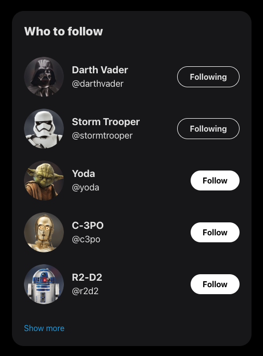

# Twitter Follow Suggestions Clone - ReactJS

This project is a learning endeavor to create a clone of Twitter's Follow Suggestions component using React. The primary goal is to implement the functionality with the `useState()` hook while adhering to best practices in React development.

## 🚀 Project Overview

<div align="center">
  
</div>

### 📚 Technologies Used

- React: A JavaScript library for building user interfaces.
- useState() Hook: Used for managing state within functional components.
- Vite: A build tool that aims to provide a faster and more agile development experience for modern web projects

### ✨ Features

- **Follow Suggestions:** Mimics Twitter's Follow Suggestions, showcasing a list of user profiles that can be followed.
- **React Implementation:** Utilizes React to build a dynamic and interactive user interface.
- **useState() Hook:** Emphasizes the use of the `useState()` hook for managing component state.

## 🧞 Getting Started

Follow these instructions to get a copy of the project up and running on your local machine for development and testing purposes.

1. **Clone the repository:**

   ```bash
   git clone https://github.com/H1V35/React-course/projects/01_twitter-follow-card.git
   cd 01_twitter-follow-card
   ```

2. **Install dependencies:**

   ```bash
   bun install
   ```

3. **Run the development server:**

   ```bash
   bun start
   ```

4. **Open in your browser:**
   Open [http://localhost:5173](http://localhost:5173) to view the app in your preferred browser.

## 🏗️ Code Structure

Inside of this project, you'll see the following folders and files:

```markdown
/src
|-- assets
| └── images
|-- App.jsx
|-- index.css
|-- main.jsx
└── TwitterFollowCard.jsx
```

## 🔍 Usage of useState() Hook

The core functionality of managing component state is implemented using the **`useState()`** hook. Here's a snippet illustrating its usage:

```javascript
import { useState } from "react";

export function TwitterFollowCard({props}) {
  const [isFollowing, setIsFollowing] = useState(initialIsFollowing);
  const [isHovered, setIsHovered] = useState(false);
  ...
  const handleClick = () => {
    setIsFollowing(!isFollowing);
  };
  ...
  return(
    ...
    <button
      onClick={handleClick}
      onMouseEnter={() => setIsHovered(true)}
      onMouseLeave={() => setIsHovered(false)}
    >
      ...
    </button>
    ...
  )
```

## 👨‍💻 Acknowledgments

- Video reference:

Curso de React [2023]: De cero hasta crear tus primeros componentes con estado

[](https://www.youtube.com/watch?v=7iobxzd_2wY)

Happy coding! 🚀
