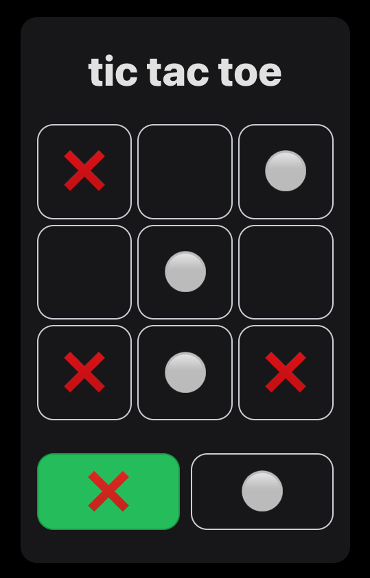

# Tic-Tac-Toe game - ReactJS

This project is a learning endeavor to create a Tic-Tac-Toe game using React. The primary goal is to implement the functionality with the `useState()` and `useEffect()` hooks while adhering to best practices in React development.

## 🚀 Project Overview

<div align="center">
  
</div>

### 📚 Technologies Used

- React: A JavaScript library for building user interfaces.
- useState() Hook: Used for managing state within functional components.
- useEffect() Hook: Used for side effects in functional components, triggering code execution in response to component changes, such as DOM updates or API calls
- Vite: A build tool that aims to provide a faster and more agile development experience for modern web projects

### ✨ Features

- **Tic-Tac-Toe game:** Implements a classic Tic-Tac-Toe game, allowing players to make moves on a 3x3 board.
- **React Implementation:** Utilizes React to build a dynamic and interactive user interface.
- **useState() Hook:** Emphasizes the use of the `useState()` hook for managing component state.
- **useEffect() Hook:** Emphasizes the use of the `useEffect()` hook for triggering code execution in response to component changes.
- **Local Storage Handling:** Manages localStorage to save ongoing game sessions that haven't concluded yet.

## 🧞 Getting Started

Follow these instructions to get a copy of the project up and running on your local machine for development and testing purposes.

1. **Clone the repository:**

   ```bash
   git clone https://github.com/H1V35/React-course/projects/02_tic-tac-toe.git
   cd 02_tic-tac-toe
   ```

2. **Install dependencies:**

   ```bash
   bun install
   ```

3. **Run the development server:**

   ```bash
   bun start
   ```

4. **Open in your browser:**
   Open [http://localhost:5173](http://localhost:5173) to view the app in your preferred browser.

## 🏗️ Code Structure

Inside of this project, you'll see the following folders and files:

```markdown
/src
|-- components
| |-- GameBoard.jsx
| |-- Square.jsx
| |-- Turn.jsx
| └── WinnerModal.jsx
|-- constants
| └── index.js
|-- logic
| |-- storage
| | └── index.js
| └── gameBoard.js
|-- App.jsx
|-- index.css
└── main.jsx
```

## 🔍 Usage of useState() Hook

The essential functionality of triggering code execution in response to component changes is implemented using the **`useEffect()`** hook. Here's a snippet illustrating its usage:

```javascript
import { useEffect } from "react";

export function App() {
  ...
  const [winner, setWinner] = useState(null);
  ...
  useEffect(() => {
    const newWinner = checkWinner(board);

    if (newWinner) {
      confetti();
      setWinner(newWinner);
    } else if (checkEndGame(board)) {
      setWinner(false);
    }
  }, [board]);
  ...
}
```

## 👨‍💻 Acknowledgments

- Video reference:

Curso de React desde cero: Crea un videojuego y una aplicación para aprender useState y useEffect

[](https://www.youtube.com/watch?v=qkzcjwnueLA)

Happy coding! 🚀
