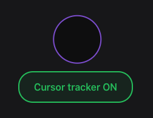

# Mouse follower - ReactJS

This project is a learning endeavor to create a cursor tracker using React. The primary goal is to implement the functionality with the `useState()` and `useEffect()` hooks while adhering to best practices in React development.

## 🚀 Project Overview

<div align="center">
  
</div>

### 📚 Technologies Used

- React: A JavaScript library for building user interfaces.
- useState() Hook: Used for managing state within functional components.
- useEffect() Hook: Used for side effects in functional components, triggering code execution in response to component changes, such as DOM updates or API calls
- Vite: A build tool that aims to provide a faster and more agile development experience for modern web projects

### ✨ Features

- **Mouse follower:** Implements a cursor tracker that activates or deactivates based on a button.
- **React Implementation:** Utilizes React to build a dynamic and interactive user interface.
- **useEffect() Hook:** Emphasizes the use of the `useEffect()` hook for triggering code execution in response to component changes.

## 🧞 Getting Started

Follow these instructions to get a copy of the project up and running on your local machine for development and testing purposes.

1. **Clone the repository:**

   ```bash
   git clone https://github.com/H1V35/React-course/projects/03_mouse-follower.git
   cd 03_mouse-follower
   ```

2. **Install dependencies:**

   ```bash
   bun install
   ```

3. **Run the development server:**

   ```bash
   bun start
   ```

4. **Open in your browser:**
   Open [http://localhost:5173](http://localhost:5173) to view the app in your preferred browser.

## 🏗️ Code Structure

Inside of this project, you'll see the following folders and files:

```markdown
/src
|-- components
| |-- Button.jsx
| └── CursorTrack.jsx
|-- App.jsx
|-- index.css
└── main.jsx
```

## 🔍 Usage of useState() Hook

The essential functionality of triggering code execution in response to component changes is implemented using the **`useEffect()`** hook. Here's a snippet illustrating its usage:

```javascript
import { useEffect } from "react";

export function App() {
  useEffect(() => {
    const handleMove = (event) => {
      const { clientX, clientY } = event;

      setPosition({ x: clientX, y: clientY });
    };

    enabled && window.addEventListener("pointermove", handleMove);

    // cleanup (useEffect return):
    //      |-- When the component unmounts
    //      └── When the dependencies change, before executing
    return () => {
      window.removeEventListener("pointermove", handleMove);
    };
  }, [enabled]);

  // useEffect dependencies:
  //      |-- []         --> Only runs once when the component mounts
  //      |-- [enabled]  --> Runs when enabled changes and when the component mounts
  //      └── undefined  --> Runs every time the component renders
  ...
}
```

## 👨‍💻 Acknowledgments

- Video reference:

Curso de React desde cero: Crea un videojuego y una aplicación para aprender useState y useEffect

[](https://www.youtube.com/watch?v=qkzcjwnueLA)

Happy coding! 🚀
