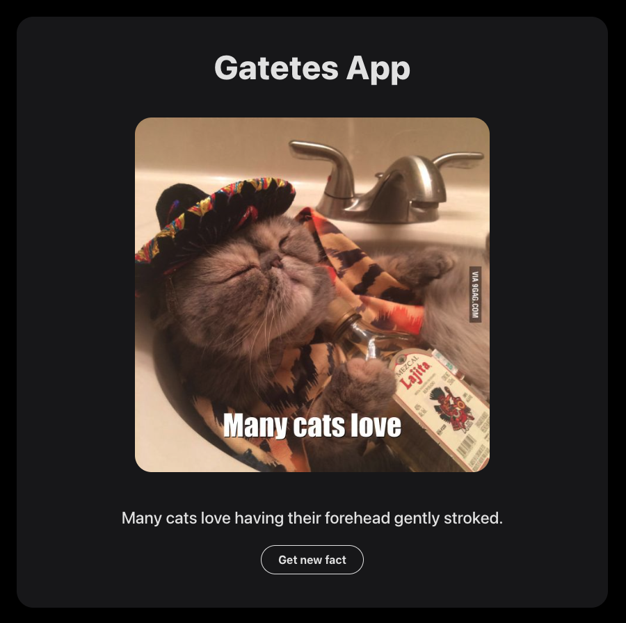

# Data fetching and states management technical test - ReactJS

This project is a demonstration of using React `custom hooks` for fetching data using `useEffect()` and asynchronous functions. The primary focus is on creating a modular and maintainable codebase while employing best practices in React development. Additionally, the project includes a small `end-to-end (E2E)` testing suite using Playwright.

## 🚀 Project Overview

<div align="center">
  
</div>

### 📚 Technologies Used

- React: A JavaScript library for building user interfaces.
- useState() Hook: Used for managing state within functional components.
- useEffect() Hook: Used for side effects in functional components, triggering code execution in response to component changes, such as DOM updates or API calls
- Custom Hooks: Implements custom hooks to encapsulate and reuse logic
- Playwright: A Node library to automate the browser for end-to-end testing.
- Vite: A build tool that aims to provide a faster and more agile development experience for modern web projects

### ✨ Features

- **Async/Await Pattern:** Demonstrates the use of the async/await pattern for handling asynchronous operations in the `useEffect()`` hook.
- **useEffect() for Data Fetching:** Utilizes the `useEffect()` hook to initiate asynchronous data fetching.
- **Custom Hooks:** Demonstrates the creation and usage of custom hooks for handling data fetching in a modular way.
- **E2E Testing with Playwright:** Includes a small suite of `end-to-end` tests using Playwright to ensure the correctness of the application.

## 🧞 Getting Started

Follow these instructions to get a copy of the project up and running on your local machine for development and testing purposes.

1. **Clone the repository:**

   ```bash
   git clone https://github.com/H1V35/React-course/projects/04_react-technical-test.git
   cd 04_react-technical-test
   ```

2. **Install dependencies:**

   ```bash
   bun install
   ```

3. **Run the development server:**

   ```bash
   bun start
   ```

4. **Open in your browser:**
   Open [http://localhost:5173](http://localhost:5173) to view the app in your preferred browser.

## 🏗️ Code Structure

Inside of this project, you'll see the following folders and files:

```markdown
/src
|-- hooks
| |-- useCatFact.js
| └── useCatImage.js
|-- services
| └── index.js
|-- App.jsx
|-- index.css
|-- main.jsx
└── tests
└── example.spec.js
```

## 🔍 Usage of Custom Hooks, useEffect() and Playwright

The core functionality of fetching data using custom hooks and **`useEffect()`** is implemented in hooks/ and services/index.js. Here's a snippet illustrating its usage:

```javascript
import { useEffect, useState } from "react";
import { getRandomFact } from "../services";

export function useCatFact() {
  const [fact, setFact] = useState();

  const refreshFact = () => {
    getRandomFact().then((newFact) => setFact(newFact));
  };

  useEffect(refreshFact, []);

  return { fact, refreshFact };
}
```

The E2E tests are located in tests/example.spec.js. The tests ensure that the data fetching and display components work correctly. Here's an example test file:

```javascript
import { test, expect } from "@playwright/test";

const LOCALHOST_URL = "http://localhost:5173/";
const CAT_PREFIX_IMAGE_URL = "https://cataas.com";

test("App shows random fact and image", async ({ page }) => {
  await page.goto(LOCALHOST_URL);

  const text = await page.getByRole("paragraph");
  const image = await page.getByRole("img");

  const textContent = await text.textContent();
  const imageSrc = await image.getAttribute("src");

  await expect(textContent?.length).toBeGreaterThan(0);
  await expect(imageSrc?.startsWith(CAT_PREFIX_IMAGE_URL)).toBeTruthy();
});
```

## 👨‍💻 Acknowledgments

- Video reference:

¡Resuelvo Prueba Técnica de React para Juniors y Trainee!

[](https://www.youtube.com/watch?v=XYpadB4VadY)

Custom Hooks + Testing con Playwright: Curso de React desde cero

[](https://www.youtube.com/watch?v=x-LcbVw99o8)

Happy coding! 🚀
